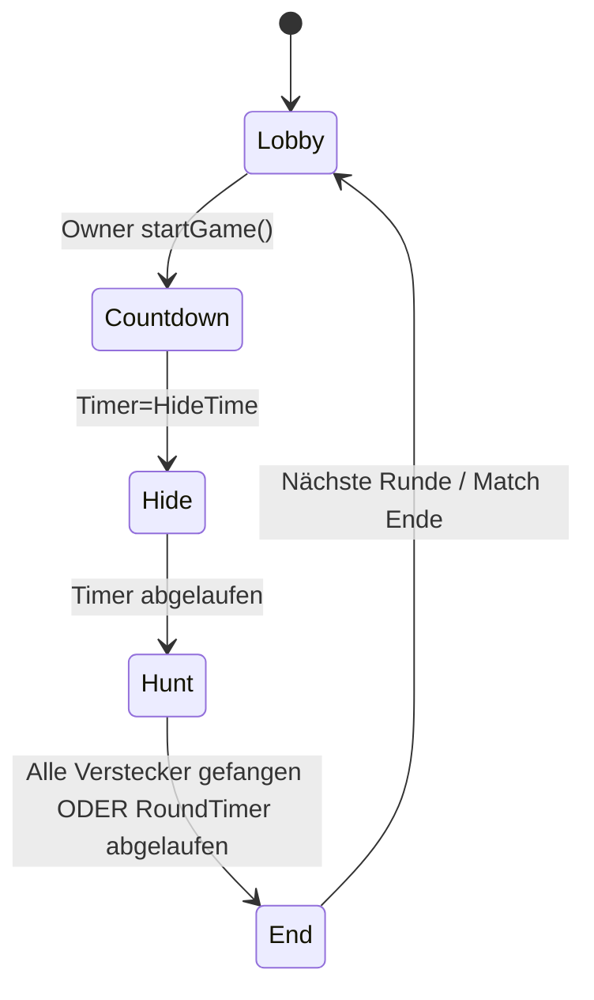

# Domain-Modell

## Kern-Entitäten & Aggregate
- Player: `Id`, `DisplayName`, `Avatar`, `DeviceId?`
- GameRoom (Aggregate Root): `Id`, `Code`, `OwnerId`, `Settings`, `Boundaries`, `State`
- Membership: `PlayerId`, `GameRoomId`, `Role`, `IsReady`, `LastSeen`
- Match: `Id`, `GameRoomId`, `Status`, `CurrentRoundNo`, `StartedAt`
- Round: `Id`, `MatchId`, `Phase` (Hide|Hunt|End), `Timer`
- Location: `Lat`, `Lng`, `Accuracy`, `Timestamp`
- TagEvent: `TaggerId`, `TaggedId`, `Distance`, `Timestamp`, `RoundId`

## Invarianten
- Spieler darf nur in 1 aktiver Lobby sein
- Boundaries (Polygon) muss geschlossen, nicht-selbstschneidend sein
- TagEvent nur gültig, wenn Distanz ≤ `Settings.TagRadius` und beide im Spielgebiet
- Rollenwechsel nur an definierten Transitionen

## Zustandsautomat (vereinfacht)

## Geofencing & Location
- Server prüft bei jedem relevanten Event: Punkt-in-Polygon, Distanz, Geschwindigkeit
- Adaptives Rate-Limiting von Standort-Updates pro Client (z. B. 1–2/s)
- Serverseitige Normalisierung: Ausreißer/zu geringe Genauigkeit verwerfen

## Fehler- und Offline-Toleranz
- Rejoin-Mechanik mit State-Reconciliation beim Wiederverbinden (Hub)
- Idempotente Commands (z. B. `tagPlayer` mit Idempotency-Key)

