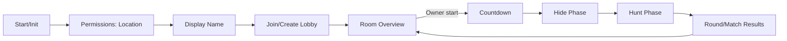

# Client UX Flow & Screens

## Hauptfluss

## Screens (Beispiele)
- Start/Init: Splash, Token-Check, Schnell-Login
- Permission: Standortabfrage mit klarer Begründung
- Name/Profile: Anzeigename, Avatar
- Lobby: Code eingeben, Raum erstellen, QR teilen
- Room Overview: Spieler-Liste, Ready, Settings (Owner), Spielgebiets-Karte
- Countdown: Timer, Rollenhinweis
- In-Game Map: Live-Karte, Rolle/Timer, Tag-Button (seeker), Warnungen außerhalb Geofence
- Results: Zusammenfassung, nächste Runde

## Edge Cases & UX-Regeln
- Standort aus: Deutliche Hinweise + schnelle Wege zur Aktivierung
- Schlechte Genauigkeit: UI-Hinweis, temporäres Ausblenden sensibler Aktionen
- Rejoin nach App-Wechsel: Automatisch, mit kurzen Toast-Infos
- Barrierefreiheit: Kontraste, Haptik, VoiceOver/ TalkBack Labels

