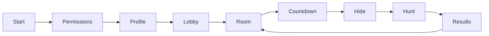

# Client UX Flow (Stand V2)

Der MAUI-Client enthält derzeit nur Grundgerüste für Screens – ideal, um die vorhandenen Services (Toasts, Navigation, Lokalisierung) zu testen. Die ursprünglichen Flow-Diagramme bezogen sich auf eine spätere Spielfassung. Deshalb hier die klare Trennung zwischen "schon da" und "Backlog".

## Aktueller Stand
| View | Datei | Bemerkung |
| --- | --- | --- |
| StartPage | `TagGame.Client/Ui/Views/Start/StartPage.xaml` | Zwei Buttons, die `IToastPublisher` demonstrieren. Gut als Einstiegspunkt für künftiges Onboarding. |
| UserInitModal | `Ui/Views/Start/UserInitModal.xaml` | Platzhalter für das erste Setup – noch ohne Binding an AuthService. |
| LobbyPages | `Ui/Views/Lobby/*.xaml` | Leere Pages (Lobby, Settings, Geofence, QR). Bereit für echte Layouts sobald Room-Feature existiert. |
| GamePages | `Ui/Views/Game/*.xaml` | Wrapper um `PageBase`, noch ohne Inhalt. |
| Settings/Profile | `Ui/Views/Settings/*.xaml` | Platzhalter, aktuell leer. |

Navigation erfolgt über `Routes` (`TagGame.Client.Core/Navigation/Routes.cs`) + `AppShell.RegisterRoutes()`. Jede Page erbt von `PageBase`, sodass ToastHost und Overlays konsistent bleiben (siehe `docs/21-Client-UI-Foundation.md`).

## Backlog: Ziel-Flow
Sobald Rooms/Matches umgesetzt sind, soll der Flow wieder wie folgt aussehen:

Leitplanken für die spätere Umsetzung:
- Permissions-Dialoge (Location, Notifications) früh, mit klarer Erklärung.
- Lobby-Screens: Code-Eingabe, Room-Erstellung, Spielerlisten, Ready-Status.
- In-Game: Karte + Timer + Tag-Aktion, gekoppelt an SignalR.
- Ergebnisse: Runden-Zusammenfassung + Einstieg in Stats (`docs/16-Statistiken.md`).

Bis diese Feature-Slices entwickelt sind, sollten UI-Änderungen sich auf Infrastruktur (Theme, Komponenten, Toasts, Lokalisierung) konzentrieren. Neue Interaktionen bitte immer mit dem entsprechenden Feature-Dokument verlinken, damit Anforderungen synchron bleiben.
