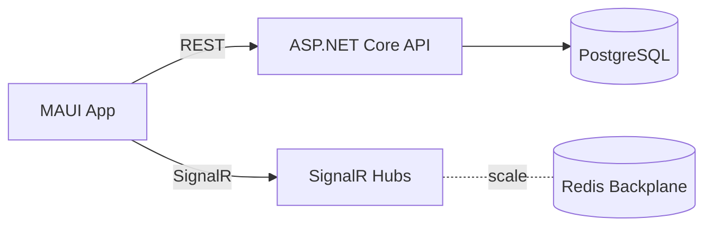
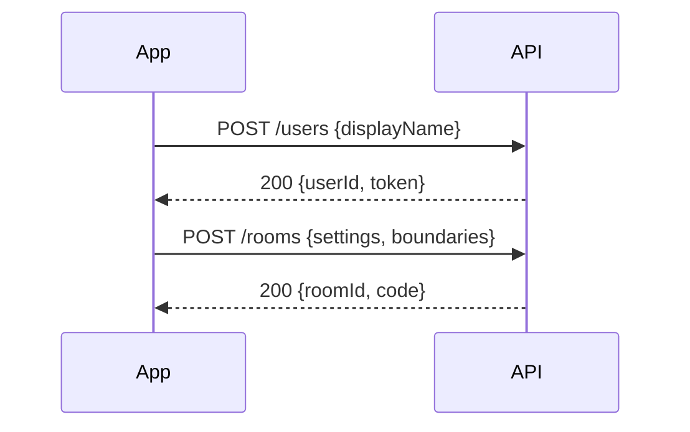
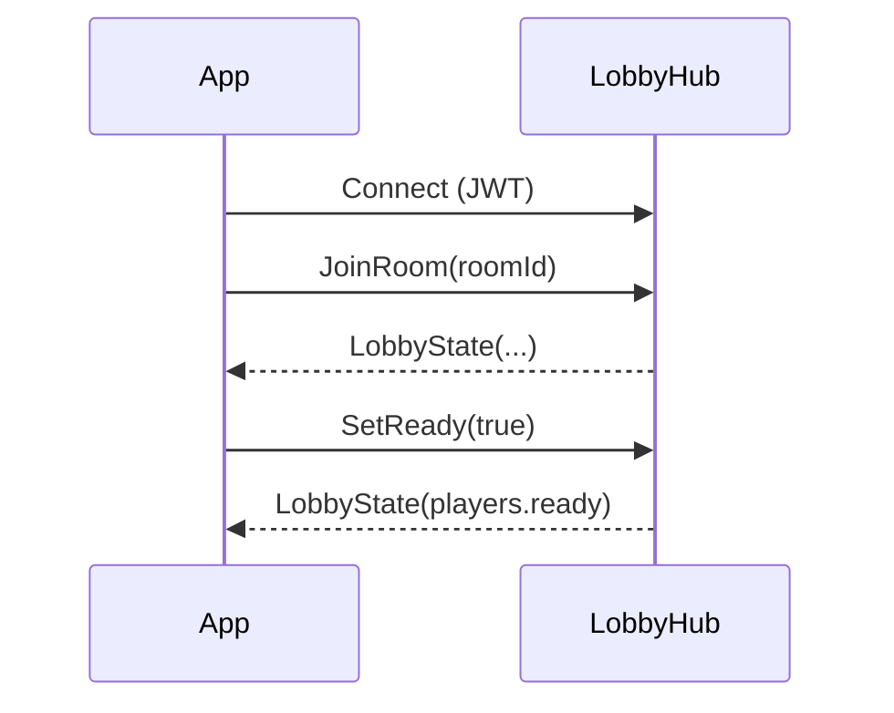
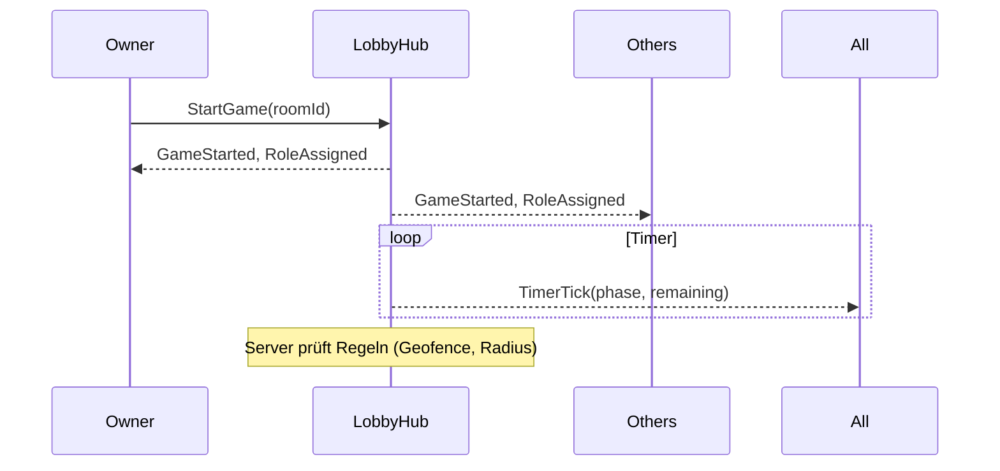
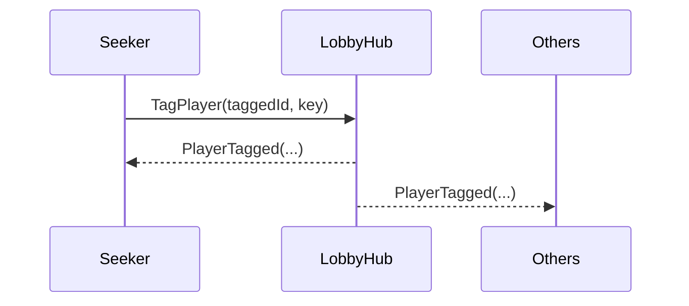

# Diagramme (Abläufe & Struktur)

## Architektur (Übersicht)

## Sequence: Nutzer registriert sich & erstellt einen Raum

## Sequence: Lobby beitreten & Ready

## Sequence: Spielstart & Phasen

## Sequence: Tag-Ereignis

