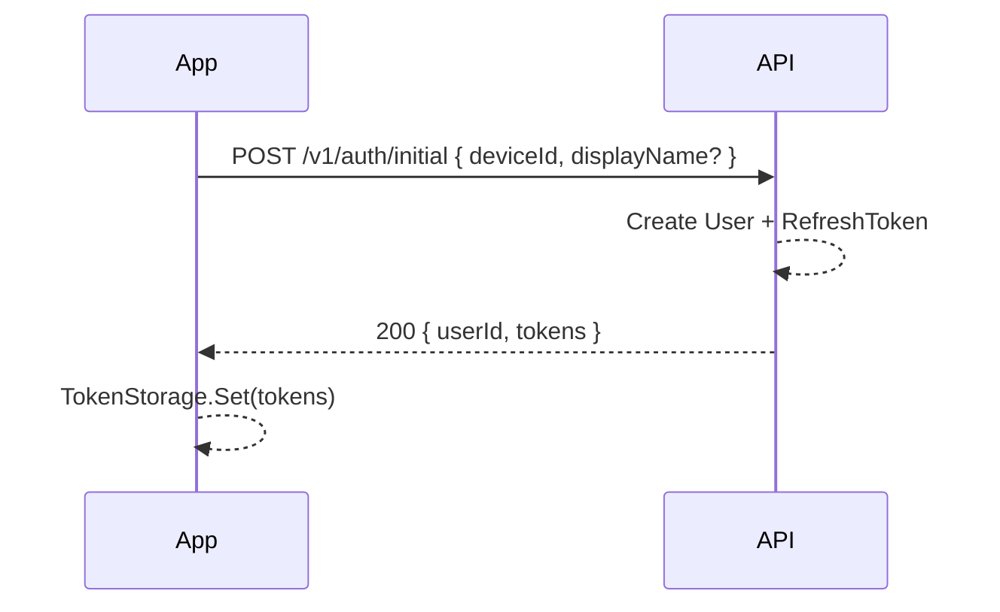
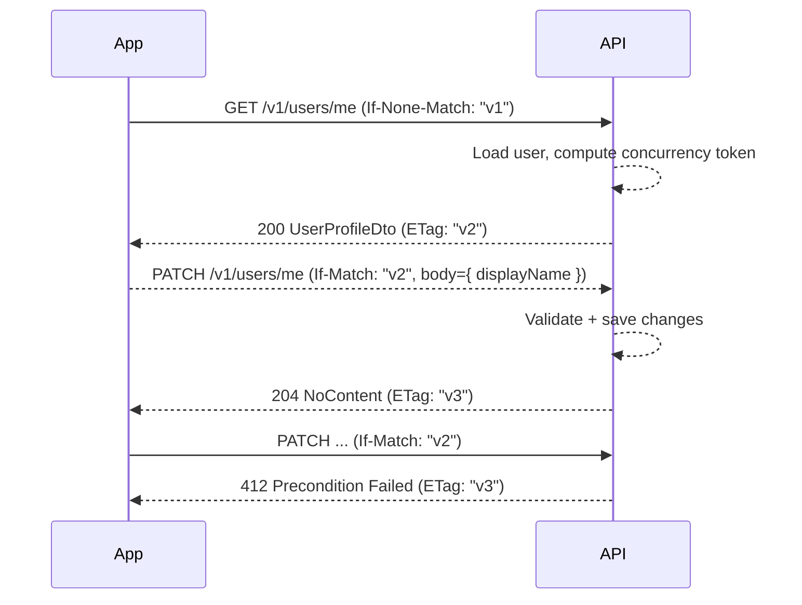

# Diagramme (Stand V2)

## Architektur-Übersicht
```mermaid
graph LR
  subgraph Client (MAUI)
    VM[Client.Core Services & ViewModels]
    UI[MAUI Views]
    VM --> UI
  end

  subgraph API (ASP.NET Core)
    REST[Minimal API Endpoints]
    HUBS[SignalR Hubs]
    CORE[TagGame.Api.Core (Services, EF)]
    REST --> CORE --> DB[(PostgreSQL)]
    HUBS --> CORE
  end

  VM <--> REST
  VM <--> HUBS
```

## Sequence: Erstregistrierung (`/v1/auth/initial`)


## Sequence: Login & Refresh-Rotation
```mermaid
sequenceDiagram
  participant App
  participant API
  App->>API: POST /v1/auth/login { deviceId }
  API-->>App: 200 { userId, tokens }
  App-->>App: Store tokens
  ... Zeit vergeht ...
  App->>API: POST /v1/auth/refresh { refreshToken }
  API-->>API: Validate + create new pair, revoke old token
  API-->>App: 200 { tokens }
  App-->>App: Replace stored tokens
  App->>API: POST /v1/auth/refresh { reusedToken }
  API-->>App: 401 { code: refresh_reuse }
  App-->>App: Clear tokens
```

## Sequence: Profil abrufen & aktualisieren (ETag)


Diese Diagramme bilden den aktuellen Funktionsumfang ab. Neue Slices (Rooms, SignalR, Chat) sollten eigene Sequenzen bekommen, sobald deren Implementierung startet.
