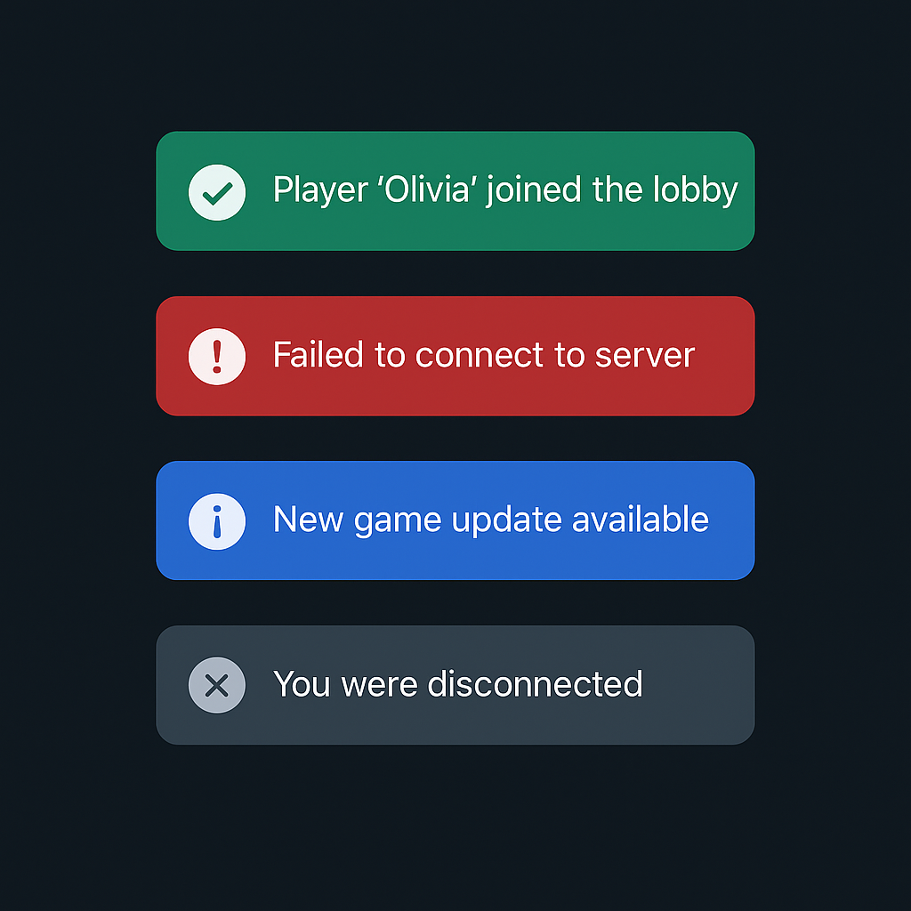

# Client UI Foundation Guidelines

> Ergänzt die Vorgaben aus [AGENTS.md](../AGENTS.md) für alle Arbeiten am MAUI‑Client (Assets, Theme, Navigation, Lokalisierung, Toasts).

## Relevante Ordner
```text
TagGame.Client/
├── App.xaml                # Ressourcendictionaries + AppThemeBinding
├── AppShell.xaml(.cs)      # Shell, Startpunkt
├── Resources/
│   ├── Fonts/
│   ├── Images/             # SVG Assets
│   └── Styles/
│       ├── CustomColors.xaml
│       └── CustomStyles.xaml
├── Ui/
│   ├── Components/
│   │   └── Toasts/
│   ├── Services/
│   └── Views/              # Pages erben von PageBase
└── Infrastructure/
    └── Notifications/      # ToastPresenter, Publisher

TagGame.Client.Core/
├── Localization/
├── Navigation/
└── Notifications/          # ToastRequest, IToastPublisher
```

## Assets & Theme
- Quelle: `Resources/Images/*.svg`, Farben/Styles in `Resources/Styles` (Details siehe [docs/20-UI-Ressourcen-Styles-und-Icons.md](20-UI-Ressourcen-Styles-und-Icons.md)).
- Styles werden in `App.xaml` gemerged; neue Farben stets in `CustomColors.xaml` anlegen und in `CustomStyles.xaml` verwenden.
- Typisches Theme-Binding (Light/Dark):
  ```xaml
  <ContentPage
      BackgroundColor="{AppThemeBinding Light={StaticResource ColorSurfaceLight}, Dark={StaticResource ColorSurfaceDark}}" />
  ```
- Assets benennen `snake_case`. Beispiel-Referenz:
  ```xaml
  <Image Source="toast_success.svg" WidthRequest="18" />
  ```

## Shell, Navigation & PageBase
- Routen liegen in `TagGame.Client.Core/Navigation/Routes.cs` und werden in `AppShell.RegisterRoutes()` gebunden:
  ```csharp
  Routing.RegisterRoute(Routes.GamePlayers, typeof(GamePlayerListPage));
  ```
- Neue Pages registrieren und zusätzlich `ShellContent` oder `Routing.RegisterRoute` ergänzen.
- Alle Views leiten von `Ui/Views/PageBase` ab. PageBase legt global den `ToastHost` sowie einen Loader über das jeweilige ContentPage-Layout:
  ```xaml
  <base:PageBase ...>
      <StackLayout>
          <!-- Inhalt -->
      </StackLayout>
  </base:PageBase>
  ```
- Navigation aus ViewModels über `INavigationService` (ShellNavService) – kein direkter Shell-Zugriff in UI-Code.

## Localization Workflow
- Schnittstelle `ILocalizer` (Client.Core) stellt `GetString`, `GetFormat`, `SetCultureAsync` bereit (Details in [docs/14-Lokalisierung.md](14-Lokalisierung.md)).
- Ressourcen liegen unter `TagGame.Client.Core/Localization/Resources/*.resx` (per MSBuild eingebunden).
- Standard-Pattern in ViewModels/Views:
```csharp
public sealed partial class LobbyViewModel
{
    private readonly ILocalizer _loc;

    public LobbyViewModel(ILocalizer loc) => _loc = loc;

    public string Title => _loc.GetString("lobby.title");
}
```
- In XAML kommt die `LocExtension` (`TagGame.Client.Ui.Extensions`) zum Einsatz:
  ```xaml
  <ContentPage xmlns:ui="clr-namespace:TagGame.Client.Ui.Extensions">
      <Label Text="{ui:Loc Key=lobby.title}" />
      <Label Text="{ui:Loc Key=lobby.playerCount, Args='3'}" />
  </ContentPage>
  ```
- Kulturwechsel erfolgt via `ILocalizer.SetCultureAsync`, das `CultureChanged` triggert; UI-Komponenten registrieren sich darauf (z.B. `ToastHost`).

## Toast Notifications
- Architektur:
  - `IToastPublisher` (Client.Core) → `ToastPublisher` (Client Infrastructure) → `ToastPresenter` → `ToastHost` (UI).
  - Requests liegen als `ToastRequest` (Type, Message, DurationMs, Priority).
- Nutzung aus ViewModels/Services:
  ```csharp
  await _toasts.PublishSuccessAsync("lobby.joined", durationMs: 4000);
  ```
- `ToastHost` stapelt alle eingehenden Toasts übereinander. Der oberste Eintrag läuft, alle darunter pausieren ihren Timer. High/Critical‑Toasts springen sofort nach oben.
- Screenshots: 
- Styling: Für jeden `ToastType` existiert ein Style (`ToastInfoStyle`, `ToastSuccessStyle`, ...). Sie werden bei Erstellung des `Toast` gesetzt, Icons liegen in `Resources/Images`.

## PR Checklist (Client UI)
- [ ] Richtige Ordnerstruktur verwendet (`TagGame.Client` vs. `Client.Core`), siehe [AGENTS.md](../AGENTS.md).
- [ ] Neue Assets in `Resources/Images` abgelegt und in `CustomStyles.xaml` referenziert.
- [ ] Shell-Routen und `Routes.cs` konsistent aktualisiert.
- [ ] Lokalisierungs-Keys ergänzt (resx + `ILocalizer` Nutzung) und Deutsch/Englisch gepflegt.
- [ ] Neue/aktualisierte Toasts respektieren Stack/Priority-Mechanik (`ToastRequest.Priority`).
- [ ] Screenshot/GIF im PR angehängt, wenn UI sichtbar verändert wurde.
